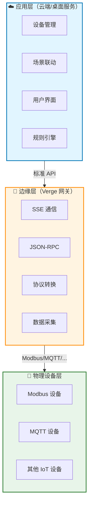
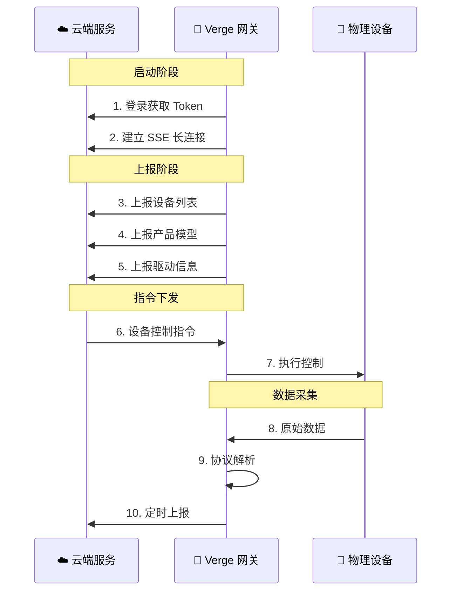

<div align="center">

# 🌟 Verge

### 一个轻量级、标准化的边缘计算网关解决方案

**专注于设备数据采集与治理，将硬件资源需求降至极致**

[](https://github.com/smartboot/verge/actions/workflows/ci.yml)
[](https://github.com/smartboot/verge/actions/workflows/docker.yml)
[](https://go.dev)
[](LICENSE)
[](https://gitee.com/smartboot/verge)

[🇺🇸 English](README_en.md) | [🇨🇳 简体中文](README.md)

> 📌 **国内用户**：访问 [Gitee 仓库](https://gitee.com/smartboot/verge) 获取更快下载速度

---

</div>

> **一个轻量级、标准化的边缘计算网关解决方案** — 专注于设备数据采集与治理，将硬件资源需求降至极致。

<div align="center">

[🚀 快速开始](#-快速开始) · [✨ 核心特性](#-核心特性) · [🏗️ 架构设计](#架构设计) · [⚙️ 配置说明](#配置说明) · [🗂️ 项目结构](#项目结构) · [🤝 贡献指南](#贡献指南)

</div>

---

## 🚀 快速开始

### 方式一：二进制部署（生产环境推荐）

从 [Gitee Releases](https://gitee.com/smartboot/verge/releases) 或 [GitHub Releases](https://github.com/smartboot/verge/releases) 下载对应平台的压缩包：

```bash
# 下载并解压（以 Linux ARM64 为例）
tar -xzf verge-linux-arm64-*.tar.gz
cd verge

# 配置管理服务地址并启动
export ENV_VERGE_BASE_URL=http://your-server:8080
./start.sh
```

**为什么推荐二进制部署？**
- ✅ 网关程序稳定后几乎无需更新，一次性部署即可
- ✅ 直接运行，无容器层开销
- ✅ 更适合工业现场环境

### 方式二：Docker 部署（家用/开发场景）

适用于家庭实验室、开发测试环境，或设备基于以太网通信的场景：

```bash
# 使用 docker-compose 一键启动
docker-compose up -d

# 查看运行状态
docker-compose ps

# 访问管理界面
open http://localhost:18080
```

> **注意**：如果设备使用串口通信，需确保容器有相应权限访问串口设备。

### 方式三：源码运行（开发调试）

```bash
# 克隆项目
git clone https://github.com/smartboot/verge.git
cd verge

# 安装依赖并运行
go mod tidy
export ENV_VERGE_BASE_URL=http://your-server:8080
go run cmd/main.go
```

---

## ✨ 核心特性

| 特性 | 图标 | 说明 |
|:-----|:----:|:-----|
| **极致轻量** | 🪶 | 聚焦设备接入核心功能，资源占用最小化 |
| **跨平台** | 🖥️ | 支持 Linux/Windows/macOS，兼容 x86_64/ARM 架构 |
| **多协议** | 🔌 | 内置 MQTT、Modbus 等工业协议，支持 Lua 自定义扩展 |
| **云边协同** | ☁️🔗 | SSE 实时通信 + JSON-RPC 标准接口 |
| **容器化** | 🐳 | 提供 Docker 镜像和 compose 配置 |
| **热插拔驱动** | ⚡ | 基于 Lua 的驱动脚本，通过 `driverbox` 模块扩展协议 |

---

## 🏗️ 架构设计

### 🎯 设计哲学：关注点分离

传统边缘网关往往集成设备接入、场景联动、规则引擎、用户界面等全量功能，导致资源浪费、OTA 成本高、硬件门槛高。

Verge 采用**云边分离**架构，将复杂的应用逻辑与稳定的设备接入层解耦：



### ⚡ 核心优势对比

| 维度 | 传统网关 | Verge 网关 | 优势 |
|:-----|:--------:|:----------:|:-----|
| 📦 资源占用 | 🔴 高 | 🟢 极致低 | 降低 90%+ 硬件成本 |
| 🔄 OTA 频率 | 🔴 高 | 🟢 几乎为零 | 一次部署，长期稳定 |
| 💻 硬件要求 | 🔴 中高配置 | 🟢 任意硬件 | 兼容低端设备 |
| 🛡️ 稳定性 | 🟡 受应用迭代影响 | 🟢 长期稳定 | 核心功能不受干扰 |

### 📊 数据流说明



### 🔧 技术栈

| 层级 | 技术组件 | 说明 |
|:-----|:---------|:-----|
| 通信层 | SSE + JSON-RPC | 实时双向通信 |
| 协议层 | Lua + Driverbox | 热插拔驱动扩展 |
| 设备层 | Modbus/MQTT/HTTP | 多协议支持 |
| 部署层 | Docker + 二进制 | 灵活部署方案 |

---

## ⚙️ 配置说明

### 🌍 环境变量

| 变量 | 说明 | 默认值 | 必填 | 示例 |
|:-----|:-----|:------:|:----:|:-----|
| `ENV_VERGE_BASE_URL` | 管理服务地址 | - | ✅ | `http://server:8080` |

> 💡 **提示**：使用 `export` 命令设置环境变量，或在启动脚本中直接定义。


## 🗂️ 项目结构

```
verge/
│
├── 📁 .github/
│   └── workflows/
│       ├── ci.yml           # 持续集成配置
│       └── docker.yml       # Docker 镜像构建配置
│
├── 📁 cmd/
│   └── main.go              # 应用程序入口
│
├── 📁 pkg/                  # 核心功能包
│   ├── rpc/                 # JSON-RPC 通信模块
│   ├── sse/                 # SSE 实时通信模块
│   └── reporter/            # 数据上报模块
│
├── 📁 res/                  # 资源文件
│   ├── driver/              # 驱动配置文件
│   └── library/
│       ├── driver/          # Lua 驱动脚本
│       ├── model/           # 设备模型定义
│       └── protocol/        # 协议解析脚本
│
├── 📁 platform/             # 各平台启动脚本
│   ├── linux/
│   ├── darwin/
│   └── windows/
│
├── 📁 deploy/               # 部署脚本
├── 📄 Dockerfile            # Docker 镜像定义
├── 📄 docker-compose.yml    # Docker Compose 配置
├── 📄 Makefile              # Make 构建命令
├── 📄 go.mod                # Go 模块依赖
└── 📄 LICENSE               # Apache 2.0 许可证
```

### 📦 核心模块说明

| 模块 | 路径 | 职责 |
|:-----|:-----|:-----|
| **SSE 通信** | [`pkg/sse/`](pkg/sse/) | 建立和维护与服务端 SSE 长连接，实现实时消息推送 |
| **JSON-RPC** | [`pkg/rpc/`](pkg/rpc/) | 处理云端下发的设备控制、配置更新等指令 |
| **数据上报** | [`pkg/reporter/`](pkg/reporter/) | 定期上报设备状态、产品模型、驱动信息等 |
| **驱动框架** | [`res/library/driver/`](res/library/driver/) | Lua 驱动脚本，支持热插拔扩展 |
| **协议库** | [`res/library/protocol/`](res/library/protocol/) | 内置 Modbus、MQTT 等协议解析 |

---

## 🤝 贡献指南

我们欢迎任何形式的贡献！

### 开发环境搭建

```bash
# 克隆项目（GitHub）
git clone https://github.com/smartboot/verge.git
cd verge

# 或者使用 Gitee（国内用户推荐）
# git clone https://gitee.com/smartboot/verge.git
# cd verge

# 安装依赖
go mod tidy

# 运行测试
go test ./...

# 构建项目
go build -o verge ./cmd/main.go
```

### 提交流程

1. Fork 本项目
2. 创建特性分支 (`git checkout -b feature/AmazingFeature`)
3. 提交更改 (`git commit -m 'Add some AmazingFeature'`)
4. 推送到分支 (`git push origin feature/AmazingFeature`)
5. 开启 Pull Request

### 代码规范

- 遵循 Go 官方代码风格
- 为新增功能添加单元测试
- 更新相关文档

---

## 📄 许可证

本项目采用 [Apache License 2.0](LICENSE) 开源。

---

<div align="center">

### 让边缘计算更简单

[](https://github.com/smartboot/verge/stargazers)
[](https://gitee.com/smartboot/verge/stargazers)

| 资源 | GitHub | Gitee |
|:-----|:-------|:------|
| 📝 问题反馈 | [Issues](https://github.com/smartboot/verge/issues) | [Issues](https://gitee.com/smartboot/verge/issues) |
| 💬 功能建议 | [Discussions](https://github.com/smartboot/verge/discussions) | - |
| 📦 下载 | [Releases](https://github.com/smartboot/verge/releases) | [Releases](https://gitee.com/smartboot/verge/releases) |

<p align="center">
  <sub>Built with ❤️ by the Verge Team</sub>
</p>

</div>
