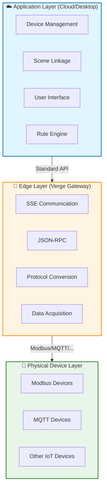
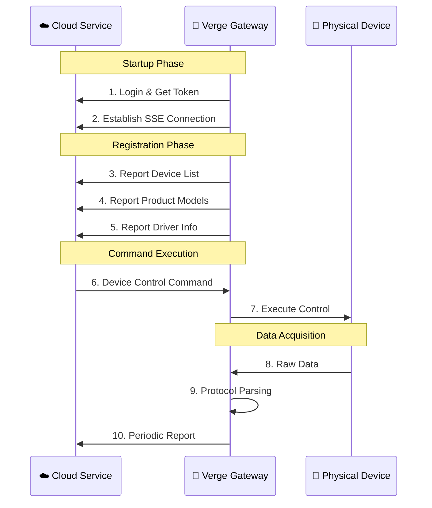

<div align="center">

# 🌟 Verge

### A Lightweight, Standardized Edge Computing Gateway Solution

**Focused on Device Data Acquisition and Governance, Minimizing Hardware Resource Requirements**

[](https://github.com/smartboot/verge/actions/workflows/ci.yml)
[](https://github.com/smartboot/verge/actions/workflows/docker.yml)
[](https://go.dev)
[](LICENSE)
[](https://github.com/smartboot/verge/releases)

[🇺🇸 English](README_en.md) | [🇨🇳 简体中文](README.md)

---

</div>

> **A lightweight, standardized edge computing gateway solution** — Focused on device data acquisition and governance, minimizing hardware resource requirements.

<div align="center">

[🚀 Quick Start](#-quick-start) · [✨ Features](#-features) · [🏗️ Architecture](#architecture) · [⚙️ Configuration](#configuration) · [🗂️ Project Structure](#project-structure) · [🤝 Contributing](#contributing)

</div>

---

## 🚀 Quick Start

### Option 1: Binary Deployment (Production Recommended)

Download the archive for your platform from [Releases](https://github.com/smartboot/verge/releases):

```bash
# Download and extract (Linux ARM64 example)
tar -xzf verge-linux-arm64-*.tar.gz
cd verge

# Configure management service URL and start
export ENV_VERGE_BASE_URL=http://your-server:8080
./start.sh
```

**Why Binary Deployment?**
- ✅ Gateway software is stable and rarely needs updates after deployment
- ✅ Direct execution, no container overhead
- ✅ Ideal for industrial environments

### Option 2: Docker Deployment (Home/Development)

Suitable for home labs, development/testing environments, or devices using Ethernet communication:

```bash
# Start with docker-compose
docker-compose up -d

# Check running status
docker-compose ps

# Access management UI
open http://localhost:18080
```

> **Note**: If devices use serial communication, ensure the container has permission to access serial devices.

### Option 3: Source Code (Development)

```bash
# Clone the repository
git clone https://github.com/smartboot/verge.git
cd verge

# Install dependencies and run
go mod tidy
export ENV_VERGE_BASE_URL=http://your-server:8080
go run cmd/main.go
```

---

## ✨ Features

| Feature | Icon | Description |
|:--------|:----:|:------------|
| **Ultra-Lightweight** | 🪶 | Focuses on core device access functionality with minimal resource usage |
| **Cross-Platform** | 🖥️ | Supports Linux/Windows/macOS, compatible with x86_64/ARM architectures |
| **Multi-Protocol** | 🔌 | Built-in MQTT, Modbus and other industrial protocols, supports Lua extensions |
| **Cloud-Edge Collaboration** | ☁️🔗 | SSE real-time communication + JSON-RPC standard interface |
| **Containerized** | 🐳 | Docker images and compose configuration provided |
| **Hot-Plug Drivers** | ⚡ | Lua-based driver scripts with `driverbox` module extension |

---

## 🏗️ Architecture

### 🎯 Design Philosophy: Separation of Concerns

Traditional edge gateways often integrate device access, scene linkage, rule engines, and user interfaces, leading to resource waste, high OTA costs, and high hardware requirements.

Verge adopts a **Cloud-Edge Separation** architecture, decoupling complex application logic from the stable device access layer:



### ⚡ Core Advantages Comparison

| Dimension | Traditional Gateway | Verge Gateway | Advantage |
|:----------|:-------------------:|:--------------:|:----------|
| 📦 Resource Usage | 🔴 High | 🟢 Ultra-Low | 90%+ hardware cost reduction |
| 🔄 OTA Frequency | 🔴 High | 🟢 Near Zero | One-time deployment, long-term stability |
| 💻 Hardware Requirements | 🔴 Mid-High | 🟢 Any Hardware | Compatible with low-end devices |
| 🛡️ Stability | 🟡 Affected by App Updates | 🟢 Long-term Stable | Core functions unaffected |

### 📊 Data Flow



### 🔧 Technology Stack

| Layer | Technology | Description |
|:------|:-----------|:------------|
| Communication | SSE + JSON-RPC | Real-time bidirectional communication |
| Protocol | Lua + Driverbox | Hot-plug driver extension |
| Device | Modbus/MQTT/HTTP | Multi-protocol support |
| Deployment | Docker + Binary | Flexible deployment options |

---

## ⚙️ Configuration

### 🌍 Environment Variables

| Variable | Description | Default | Required | Example |
|:---------|:------------|:-------:|:--------:|:--------|
| `ENV_VERGE_BASE_URL` | Management Service URL | - | ✅ | `http://server:8080` |

> 💡 **Tip**: Set environment variables using `export` command or define directly in the startup script.

## 🗂️ Project Structure

```
verge/
│
├── 📁 .github/
│   └── workflows/
│       ├── ci.yml           # CI configuration
│       └── docker.yml       # Docker image build configuration
│
├── 📁 cmd/
│   └── main.go              # Application entry point
│
├── 📁 pkg/                  # Core packages
│   ├── rpc/                 # JSON-RPC communication module
│   ├── sse/                 # SSE real-time communication module
│   └── reporter/            # Data reporting module
│
├── 📁 res/                  # Resource files
│   ├── driver/              # Driver configuration files
│   └── library/
│       ├── driver/          # Lua driver scripts
│       ├── model/           # Device model definitions
│       └── protocol/        # Protocol parsing scripts
│
├── 📁 platform/             # Platform startup scripts
│   ├── linux/
│   ├── darwin/
│   └── windows/
│
├── 📁 deploy/               # Deployment scripts
├── 📄 Dockerfile            # Docker image definition
├── 📄 docker-compose.yml    # Docker Compose configuration
├── 📄 Makefile              # Make build commands
├── 📄 go.mod                # Go module dependencies
└── 📄 LICENSE               # Apache 2.0 License
```

### 📦 Core Modules

| Module | Path | Responsibility |
|:-------|:-----|:---------------|
| **SSE Communication** | [`pkg/sse/`](pkg/sse/) | Establish and maintain SSE connection with server |
| **JSON-RPC** | [`pkg/rpc/`](pkg/rpc/) | Handle device control and configuration update commands |
| **Data Reporting** | [`pkg/reporter/`](pkg/reporter/) | Periodically report device status, models, and driver info |
| **Driver Framework** | [`res/library/driver/`](res/library/driver/) | Lua driver scripts with hot-plug support |
| **Protocol Library** | [`res/library/protocol/`](res/library/protocol/) | Built-in Modbus, MQTT protocol parsing |

---

## 🤝 Contributing

We welcome all forms of contributions!

### Development Setup

```bash
# Clone the repository
git clone https://github.com/smartboot/verge.git
cd verge

# Install dependencies
go mod tidy

# Run tests
go test ./...

# Build the project
go build -o verge ./cmd/main.go
```

### Submission Process

1. Fork the repository
2. Create a feature branch (`git checkout -b feature/AmazingFeature`)
3. Commit your changes (`git commit -m 'Add some AmazingFeature'`)
4. Push to the branch (`git push origin feature/AmazingFeature`)
5. Open a Pull Request

### Code Guidelines

- Follow Go official style guide
- Add unit tests for new features
- Update relevant documentation

---

## 📄 License

This project is licensed under the [Apache License 2.0](LICENSE).

---

<div align="center">

### Make Edge Computing Simpler

[](https://github.com/smartboot/verge/stargazers)
[](https://github.com/smartboot/verge/network/members)
[](https://github.com/smartboot/verge/issues)

| Resource | Link |
|:---------|:-----|
| 📝 [Report Issue](https://github.com/smartboot/verge/issues) | Report bugs or request features |
| 💬 [Discussions](https://github.com/smartboot/verge/discussions) | Join community discussions |
| 📦 [Releases](https://github.com/smartboot/verge/releases) | Download latest version |

<p align="center">
  <sub>Built with ❤️ by the Verge Team</sub>
</p>

</div>
