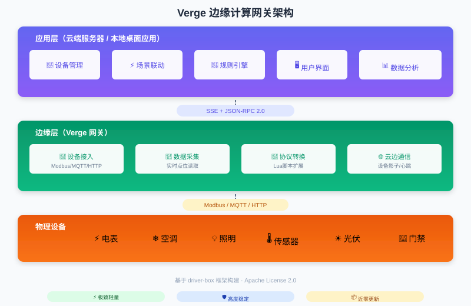

# Verge

[](https://github.com/smartboot/verge/actions/workflows/ci.yml)
[](https://github.com/smartboot/verge/actions/workflows/docker.yml)
[](https://go.dev)
[](LICENSE)

[🇺🇸 English](README.md) | [🇨🇳 简体中文](README_zh.md) 

> 一个轻量级、标准化的边缘计算网关解决方案 — 专注于设备数据采集与治理，将硬件资源需求降至极致。

## 设计哲学

传统边缘网关往往集成了设备接入、场景联动、规则引擎、用户界面等全量功能。这种"大而全"的设计导致：

- 资源占用高，需要高配硬件
- OTA 频繁，任何功能迭代都可能影响核心稳定性
- 硬件门槛高，难以部署在低端设备

**Verge 采用「应用与边缘分离」架构**：将复杂的业务逻辑（场景联动、规则引擎、用户界面）放在应用层，边缘网关只负责最核心的设备接入与数据采集。应用层可以部署在云端服务器，也可以作为本地桌面应用运行。



### 核心优势

| 维度 | 传统网关 | Verge 网关 |
|------|----------|------------|
| 资源占用 | 高 | 极致低 |
| OTA 频率 | 高 | 几乎为零 |
| 硬件要求 | 中高配置 | 任意硬件 |
| 稳定性 | 受应用迭代影响 | 长期稳定 |

## 技术实现

Verge 基于 [driver-box](https://gitee.com/ibuilding-x/driver-box) 框架构建，复用其成熟的设备接入能力。

### 云边通信

- **SSE（Server-Sent Events）** - 保持与云端的长连接，实时接收指令
- **JSON-RPC 2.0** - 标准化的远程调用协议

### 通信流程

```
┌─────────┐                                          ┌─────────┐
│  Verge  │                                          │  云端   │
└────┬────┘                                          └────┬────┘
     │                                                    │
     │  1. 登录（使用序列号认证）                          │
     │ ──────────────────────────────────────────────►    │
     │                                                    │
     │  2. 返回 Token                                     │
     │ ◄──────────────────────────────────────────────    │
     │                                                    │
     │  3. 建立 SSE 长连接                                │
     │ ──────────────────────────────────────────────►    │
     │                                                    │
     │  4. 定时上报设备影子、节点元数据                    │
     │ ──────────────────────────────────────────────►    │
     │                                                    │
     │  5. 下发控制指令（JSON-RPC）                        │
     │ ◄──────────────────────────────────────────────    │
     │                                                    │
     │  6. 执行设备操作，返回结果                          │
     │ ──────────────────────────────────────────────►    │
     │                                                    │
```

### 支持的 JSON-RPC 方法

| 方法 | 说明 |
|------|------|
| `device.control` | 设备控制（读写设备点位） |
| `devices.add` | 添加设备 |
| `devices.delete` | 删除设备 |
| `devices.report` | 设备数据上报 |
| `products.report` | 产品信息上报 |
| `product.import` | 导入产品模型 |
| `node.configChanged` | 配置变更通知 |
| `node.networkStatus` | 网络状态查询 |
| `node.command` | 执行自定义命令 |

## 快速开始

### 环境要求

- Go 1.23+（源码编译）
- Docker & Docker Compose（容器部署）

### 方式一：Docker Compose

适用于家庭实验室、开发测试环境：

```bash
# 克隆项目
git clone https://gitee.com/smartboot/verge.git
cd verge

# 启动服务
docker-compose up -d

# 查看日志
docker-compose logs -f verge
```

管理界面地址：`http://localhost:18080`

### 方式二：二进制部署（生产环境推荐）

**为什么推荐二进制部署？**

- 网关程序稳定后几乎无需更新，一次性部署即可长期运行
- 直接运行，无容器层开销
- 更适合工业现场环境

从 [Releases](https://gitee.com/smartboot/verge/releases) 或 [Gitee Releases](https://gitee.com/smartboot/verge/releases) 下载：

```bash
# 解压
tar -xzf verge-linux-arm64-*.tar.gz
cd verge

# 配置云端地址
export ENV_VERGE_BASE_URL=http://your-server:8080

# 启动
./start.sh
```

### 方式三：源码运行

```bash
git clone https://gitee.com/smartboot/verge.git
cd verge

export ENV_VERGE_BASE_URL=http://your-server:8080

go mod tidy
go run cmd/main.go
```

## 配置

### 环境变量

| 变量 | 说明 | 必填 |
|------|------|------|
| `ENV_VERGE_BASE_URL` | 云端管理服务地址 | 是 |

### 目录结构

```
verge/
├── cmd/main.go              # 应用入口
├── pkg/
│   ├── sse/                 # SSE 连接管理
│   ├── rpc/                 # JSON-RPC 处理器
│   └── reporter/            # 数据上报模块
├── res/
│   ├── driver/              # 驱动配置（设备模型、连接配置）
│   └── library/
│       ├── driver/          # Lua 驱动脚本
│       ├── model/           # 产品模型定义
│       └── protocol/        # 协议解析脚本
├── platform/                # 各平台启动脚本
├── Dockerfile
└── docker-compose.yml
```

## 扩展开发

### 添加 RPC 方法

在 [`pkg/rpc/handlers.go`](pkg/rpc/handlers.go) 中注册：

```go
var Handlers = map[string]func(Context, interface{}) error{
    "your.method": HandleYourMethod,
}
```

### 自定义设备驱动

在 `res/library/driver/` 添加 Lua 脚本，参考 [driver-box 文档](https://gitee.com/ibuilding-x/driver-box)。

## 相关项目

- [driver-box](https://gitee.com/ibuilding-x/driver-box) - 设备接入框架
- [verge-ui](https://gitee.com/smartboot/verge-ui) - Web 管理界面

## 许可证

[Apache License 2.0](LICENSE)
